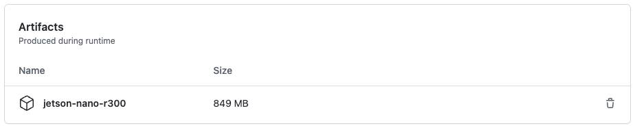
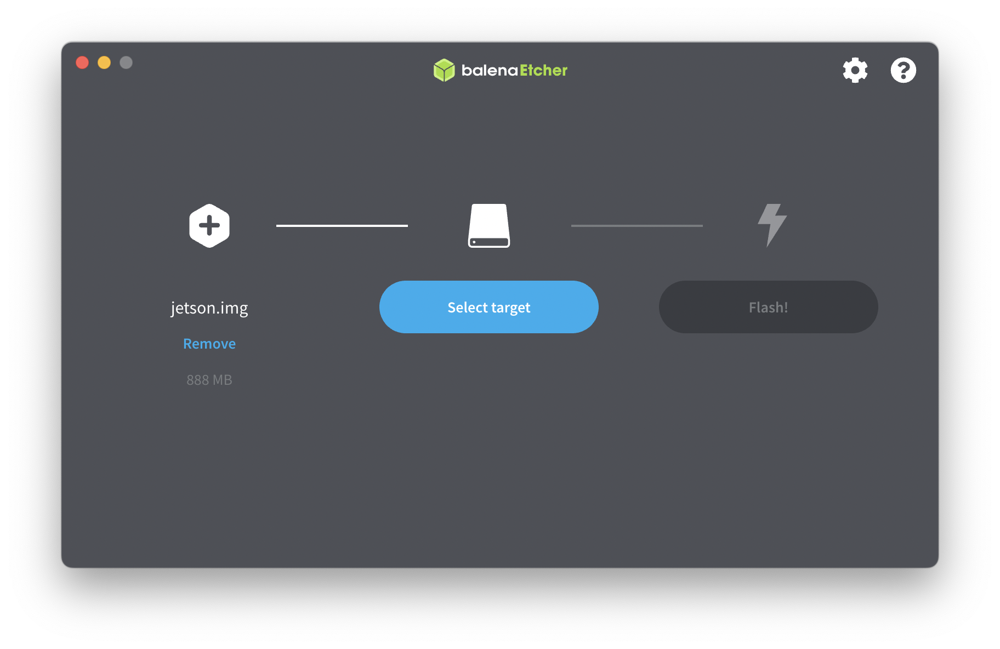

# Jetson Nano Image

> **tl;dr;** Build sd-card flashable images for [Jetson Nano](https://developer.nvidia.com/embedded/jetson-nano-developer-kit) dev kits using Docker and Github Actions.

## Problem

After buying a hobby robot and companion Jetson Nano, I wanted to update the base image for my robot and iterate on my robot software. I struggled to find a simple set of instructions and scripts that would let me create my own images and flash them to an SD card from my Mac laptop.

Nvidia privides a set of docs, scripts, and guides from their [linux-for-tegra](https://developer.nvidia.com/embedded/jetson-linux-r341) environment but I found these cumbersome to understand and modify. Some of the scripts required a linux environment to even run.

I wanted something simpler. I wanted to be able to iterate on the base image quickly, and when ready, use Github Actions to automatically build a sd-card flash ready image.

## Solution

Using Docker and [buildx](https://docs.docker.com/buildx/working-with-buildx/) this repository is setup to create arm64 docker images. These images can then be turned into sd-card flashable .img files using the `create-image.sh` script. This script use nvidia l4t scripts to configure the rootfs with the correct boot files.

Finally, all of this is automatically run with Github actions. After pushing a change to the repo, actions run and produce [artifacts](https://docs.github.com/en/actions/using-workflows/storing-workflow-data-as-artifacts) with `.img` files that I can flash to an sd-card.

Here's a screenshot of the artifact ready to download.



Once downloaded I can flash the image to the sd card.



Now I'm ready to boot the nano.

## Customizing

You can make your own images by forking this repo and modifying the `Dockerfile`. Your fork will automatically run the forked Github Actions and you'll end up with ready-to-flash images from your changes.

## Credentials

The default credentials:

username: `jetson`  
password: `jetson`

## Local Development

One advantage of using Docker to setup the root file system is the ability to iterate locally and test your changes.

Here are a few commands you can use to work locally and make sure everything installs before you push your changes to CI.

### Build the rootfs image

```
docker buildx build --platform linux/arm64 -t jetson-nano-image .
```

### Run the image (without any init system)

```
docker run -it --rm --user 1000:1000 jetson-nano-image /bin/bash
```

### Run the built image and invoke systemd init to see what runs on startup

```
docker run -it --rm --cap-add SYS_ADMIN -v /sys/fs/cgroup/:/sys/fs/cgroup:ro jetson-nano-image /sbin/init
```

### Make a flashable image

If you are on linux, you can turn the Docker image into a flashable image

```shell
# Export the rootfs image to a folder on your file-system
# Nvidia l4t tools turn this folder into a .img file you can flash
docker export $(docker create --name nano-rootfs --platform linux/arm64 jetson-nano-image) -o rootfs.tar

mkdir -p /tmp/jetson-builder/rootfs
sudo tar --same-owner -xf rootfs.tar -C /tmp/jetson-builder/rootfs

# Create a jetson.img from the `rootfs` you can flash to an SD card
sudo -E ./create-image.sh
```

## Supported boards:

- [Jetson nano](https://developer.nvidia.com/embedded/jetson-nano-developer-kit)
- [Jetson nano 2GB](https://developer.nvidia.com/embedded/jetson-nano-2gb-developer-kit)

## References

This work builds upon the learnings from this great post by pythops:

- https://pythops.com/post/create-your-own-image-for-jetson-nano-board.html
- https://github.com/pythops/jetson-nano-image

### Additional links

- https://developer.nvidia.com/embedded/linux-tegra
- https://docs.nvidia.com/jetson/l4t/index.html#page/Tegra%20Linux%20Driver%20Package%20Development%20Guide/updating_jetson_and_host.html
- https://docs.nvidia.com/jetson/l4t/index.html#page/Tegra%20Linux%20Driver%20Package%20Development%20Guide/flashing.html#wwpID0E0CM0HA

## License

MIT
